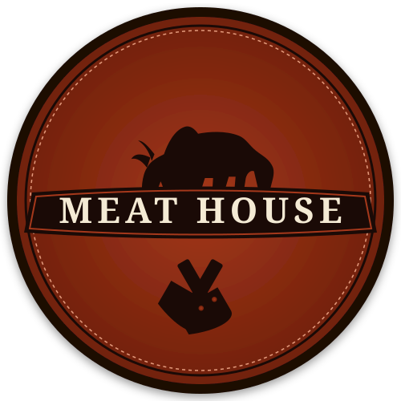

# 🥩 Meat House "The Butcher's" — Luxury E-Commerce Website



> **Meat House "The Butcher's"** is a modern, luxury, fully responsive bilingual (Arabic / English) e-commerce web application for a premier Saudi butcher shop based in **Safwa, Eastern Province, Saudi Arabia**.

---

## 🌟 Key Features

- **🌐 Fully Bilingual (Arabic & English)**:
  - Complete RTL support for Arabic (with Google Font **Cairo**).
  - Complete LTR support for English (with Google Font **Outfit**).
  - Instant language switcher in navbar (`AR` / `EN`).

- **🌗 Light & Dark Theme Support**:
  - Animated theme toggle button in the header navbar.
  - Persistent theme setting in `localStorage`.

- **🥩 Dynamic Weight Pricing Engine (Base = 1 KG)**:
  - Base displayed prices represent **1 KG** (e.g., `60 SAR / KG` or `60 ر.س / كيلو`).
  - Interactive Weight Selector Pills (`500g`, `1 KG`, `2 KG`) dynamically calculate exact prices in real-time.
  - **Item Formula**: `Base Price × Weight Multiplier × Quantity`.

- **📱 Direct WhatsApp Checkout (+966568148422)**:
  - Automatic pre-filled itemized invoice generator sending orders directly to WhatsApp.
  - Floating animated WhatsApp quick-order button.

- **🚚 Safwa Fixed Delivery Fee (5 SAR)**:
  - Fixed 5 SAR delivery rate for all districts within Safwa, KSA.

- **🔪 Custom Butcher Knife Cursor**:
  - Desktop minimal butcher cleaver cursor with hover scaling and chopping click micro-animations.
  - Automatically disabled on mobile & touch devices.

- **📱 100% Mobile Responsive**:
  - Smooth drawer menu for mobile navigation and high-performance layout on all devices.

---

## 📁 Project Structure

```
meat-house/
├── index.html                # Entry HTML shell
├── run_website.bat           # One-click Windows starter script
├── README.md                 # Project documentation
├── .gitignore                # Git ignore rules
├── css/
│   ├── main.css              # Styling tokens, responsive grid, light/dark themes
│   └── cursor.css            # Custom butcher knife cursor styling
├── js/
│   ├── bundle.js             # Unified browser bundle (Works on file:// and http://)
│   ├── app.js                # ES module router
│   ├── data/                 # Product catalog, categories & special offers
│   ├── state/                # i18n dictionary, theme & cart state
│   ├── components/           # Navbar, Footer, Product Card, Cart Drawer, Cursor
│   └── pages/                # Home, Products, Detail Modal, Offers, Checkout, About, Contact
└── assets/
    ├── images/               # Food photography & visual assets
    └── logo/                 # Official Meat House SVG logos
```

---

## 🚀 How to Run Locally

1. Clone or download this repository.
2. Open `index.html` directly in any web browser!
3. Or double-click `run_website.bat`!
4. Or serve via Python:
   ```bash
   python -m http.server 8080
   ```
   Then open `http://localhost:8080` in your browser.

---

## ☁️ How to Deploy on GitHub Pages (Free Hosting)

1. Push your repository to GitHub:
   ```bash
   git init
   git add .
   git commit -m "feat: Initial commit for Meat House"
   git branch -M main
   git remote add origin https://github.com/YOUR_USERNAME/meat-house.git
   git push -u origin main
   ```
2. Go to your GitHub repository -> **Settings** -> **Pages**.
3. Under **Branch**, select `main` and click **Save**.
4. Your website will be live at `https://YOUR_USERNAME.github.io/meat-house/`!

---

## 📞 Business Information

- **Brand**: MEAT HOUSE "The Butcher's"
- **Location**: Safwa, Al-Orouba Dist., Economy Complex, Eastern Province, Saudi Arabia
- **Phone & WhatsApp**: [+966 56 814 8422](https://wa.me/966568148422)
- **Instagram**: [@meathouse.sa](https://www.instagram.com/meathouse.sa)

© 2026 Meat House. All Rights Reserved.
